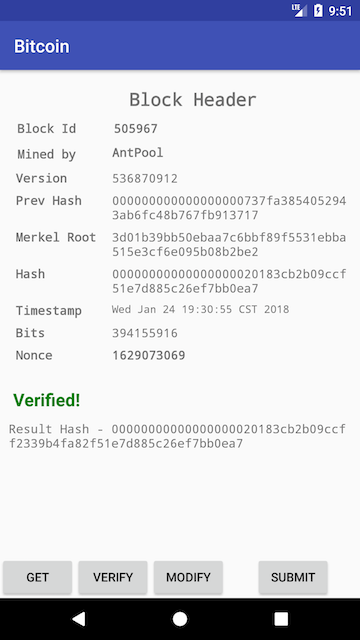

Bitcoin Hashing App
===============
## Problem
The problem is concerned with writing client and server apps to distribute and solve mathematical puzzles that lead to mining bitcoins. The server distributes blocks to the clients (Android devices). The latter then solve the given block and once a solution is found, submit it back to the server.

## Challenges

Mining Bitcoins is a non-trivial operation taking enormous amounts of computation and energy. Block chains rely on the amount of computation and processing that goes in demonstrating proof-of-work. The Bitcoin network regulates the difficulty of solving the problems in a way that if finding solution becomes easier for the computing clients, the difficulty level goes up. As such, it generally takes ~10 min to find a solution with dedicated GPU, FPGA or ASIC processors. On Android devices, it may take several days or weeks to find solution for a real block.

Given this background, for the scope of this app, finding solution to a real yet-to-be-mined block with an Android app is very challenging. The best we can achieve, is to verify if a block that is claimed to be mined has indeed been mined. This is achieved by computing the hash of certain fields of the given block along with the nonce mentioned in the block header. If the computed hash matches with the block hash in the header, the block is verified.

Note that in order to mine Bitcoins, the same hashing algorithm is used with different values of the nonce till the result is obtained. It could take millions of iterations with different values till the resulting hash is found.

In the current scope, this app verifies blocks from the Bitcoin blockchain. It connects to a AWS hosted server which pulls a real block from the blockchain. The app then computes the hash according to the [mining protocol](https://en.bitcoin.it/wiki/Block_hashing_algorithm) and verifies if the computed hash matches with that in the block.

## Solution
When the app requests a block, the server connects to a [bitcoin pool](http://bitaps.com) to pull a random block from the blockchain. The app can then verify the block for correctness, test other nonces by modifying the nonce value and submit the verified block back to the server. The server does not process or forward the submitted block.

There is no authentication between the app and the server as only the verified blocks in the blockchain are accessed.

The app interface is as follows:

**GET** button submits a request to the server hosted on AWS. The server then pulls a random block off of the blockchain

**VERIFY** button locally computes the hash of the block according to the protocol and compares it with the hash given in the block. If it matches, it prints **Verified!** else it prints **Not Verified!**, along with the computed hash

**MODIFY** button modifies the nonce to a random value and recomputes the hash. This will invariably result in the hash not matching. This is just to demonstrate that several nonces need to be tried to compute the resulting hash

**SUBMIT** will make a POST request to the server with the computed hash. The server does not process this request.

## Tech Stack
### App
* The Android app is coded in Kotlin
* Dagger 2.x for dependency injection
* RxJava2 for observing events
* Constraint Layout for views
* ViewModel and LiveData for MVVM pattern
** I chose ViewModel so that I have a ready access to lifecycle safe/aware component that can easily connect and process in the background.
* Jackson for json parsing
* Retrofit2 for making HTTP binding
* OkHttp3 for connecting with the server
* Timber for Logging
* JUnit for testing

### Server
* Hosted on AWS
* Javascript / Node JS for operation
* Bitaps APIs to access the Bitcoin blockchain

